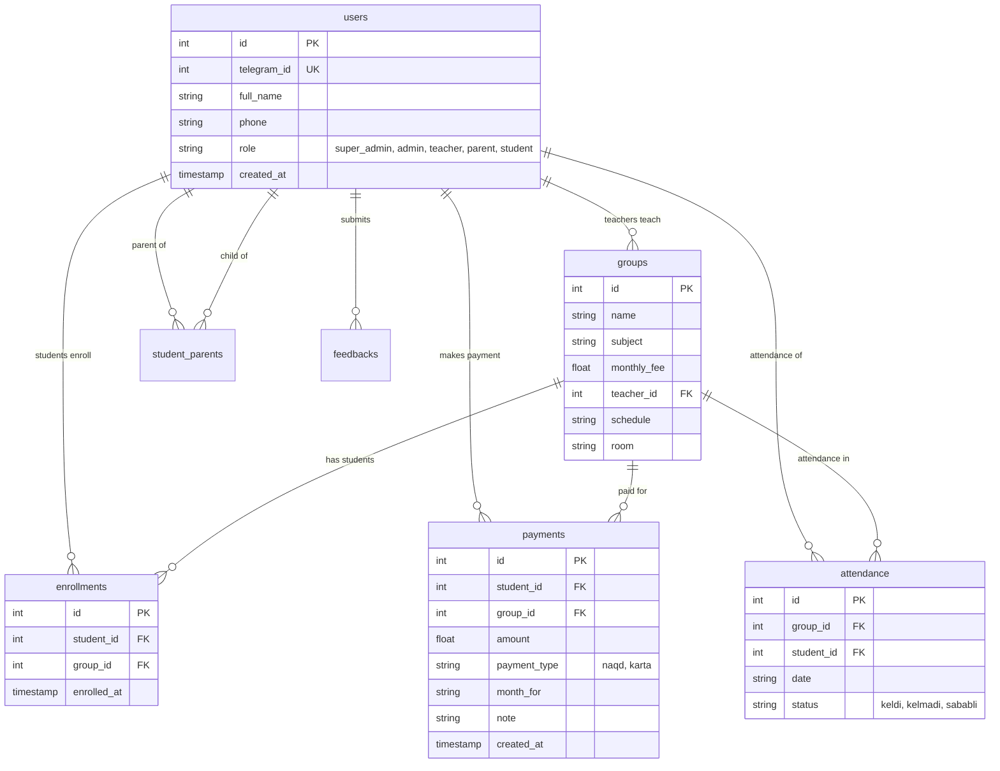

# 🎓 EduCenter Bot & CRM — O'quv Markazi Boshqaruv Tizimi

**EduCenter Bot & CRM** — O'quv markazlari faoliyatini to'liq avtomatlashtirish uchun ishlab chiqilgan zamonaviy, tezkor va xavfsiz platforma. Tizim **Telegram Bot (Aiogram 3)** va **FastAPI Web CRM** modullarini o'zaro uzviy bog'lagan holda ishlaydi.

---

## 📁 Loyihaning To'liq Strukturasi

```
educenter_bot/
│
├── 📂 bot/                         # Telegram Bot moduli (Aiogram 3)
│   ├── __init__.py
│   ├── bot.py                     # Botni ishga tushirish va routerni sozlash
│   ├── 📂 handlers/               # Xabarlar va buyruqlar ishlovchilari
│   │   ├── __init__.py
│   │   ├── admin.py               # Admin menyusi, statistika, to'lovlar, murojaatlarga javob
│   │   ├── teacher.py             # O'qituvchi menyusi, guruhlar ro'yxati, oniy davomat + ota-ona ogohlantirish
│   │   └── student.py             # O'quvchi & Ota-ona kabineti, farzandlar monitoringi, murojaat yuborish
│   └── 📂 keyboards/              # Tugmalar (Keyboards)
│       ├── __init__.py
│       ├── default.py             # Asosiy pastki ReplyKeyboard menyulari (5 ta rolga mos)
│       └── inline.py              # Interaktiv InlineKeyboard tugmalari (davomat, farzandlar, toifalar)
│
├── 📂 services/                    # Xizmatlar qatlami
│   ├── __init__.py
│   └── notifications.py           # Real-time Telegram xabarnomalar (davomat, cheklar, murojaatlar)
│
├── 📂 database/                    # Ma'lumotlar bazasi qatlami (aiosqlite)
│   ├── __init__.py
│   ├── models.py                  # Jadvallar (users, groups, enrollments, payments, attendance, student_parents, feedbacks)
│   └── db.py                      # Asinxron CRUD operatsiyalari va so'rovlar
│
├── 📂 webapp/                      # FastAPI Web CRM boshqaruv paneli
│   ├── __init__.py
│   ├── app.py                     # FastAPI ilovasi, API endpointlar, Excel eksport, ota-ona bog'lash, murojaatlar
│   ├── 📂 static/                 # Statik fayllar (CSS, JS, Rasmlar)
│   │   └── 📂 css/
│   │       └── style.css          # Zamonaviy dizayn tizimi (Glassmorphism, Card UI, Badges)
│   └── 📂 templates/              # Jinja2 HTML shablonlari
│       ├── home.html              # Bosh portal sahifasi
│       ├── admin.html             # Admin Dashboard (Oila bog'lash, Murojaatlar, KPI, guruhlar, to'lovlar)
│       ├── teacher.html           # O'qituvchi shaxsiy portali
│       └── parent.html            # Ko'p farzandli ota-onalar va o'quvchilar shaxsiy kabineti + murojaat formasi
│
├── 📂 tests/                       # Avtomatlashtirilgan testlar (pytest)
│   ├── test_parent_and_feedback.py# Ota-ona va farzand bog'lash, xabarnomalar va murojaatlar testlari
│   ├── test_real_features.py      # Baza CRUD, biriktirish, to'lov va davomat testlari
│   ├── test_student_handlers.py   # Bot matnlari va javoblari testlari
│   └── test_webapp.py             # FastAPI API endpointlari va HTML sahifalar testlari
│
├── ⚙️ config.py                    # Konfiguratsiya, atrof-muhit sozlamalari, dinamik URL lar
├── 🚀 main.py                     # Bot va WebApp ni parallel ishga tushiruvchi asosiy fayl
├── 📄 requirements.txt            # Python kutubxonalari ro'yxati
├── 🔒 .env.example                # Maxfiy kalitlar va sozlamalar namunasi
├── 🐳 Dockerfile                  # Docker konteyner fayli
├── 🐳 docker-compose.yml          # Docker Compose orqali 1-bosqichda ishga tushirish
├── 🐧 educenter.service           # Linux VPS (systemd) doimiy ishlash xizmati fayli
├── 🗄 educenter.db                # SQLite ma'lumotlar bazasi fayli
└── 📖 README.md                   # Loyiha hujjatlari va qo'llanmasi
```

---

## 📌 5 Ta Rol va Ularning Imkoniyatlari

Tizim o'quv markazining barcha ishtirokchilarini qamrab oluvchi **5 ta alohida rol** asosida ishlaydi:

1. **👑 Super Admin**:
   - To'liq tizim boshqaruvi, yangi adminlar tayinlash, umumiy moliyaviy hisobotlar va eksport.
2. **🛡 Admin**:
   - Guruhlarni boshqarish, o'quvchilarni guruhlarga biriktirish, to'lovlarni qabul qilish.
   - **Oila a'zolarini bog'lash**: Ota-onani o'z farzandi/farzandlariga biriktirish (`tab-family`).
   - **Murojaatlarni ko'rish va javob berish**: Ota-onalar va o'quvchilardan tushgan murojaatlarni Telegram yoki Web panel orqali 1 bosishda ko'rib, javob yo'llash.
3. **👨‍🏫 O'qituvchi (Teacher)**:
   - Biriktirilgan guruhlar ro'yxati, dars jadvali, o'quvchilar ro'yxati.
   - **Interaktiv oniy davomat**: Har bir dars uchun o'quvchilarni `🟢 Keldi`, `🔴 Kelmadi`, `🟡 Sababli` qilib belgilash. Davomat yakunlanishi bilan darsga kelmagan bolaning ota-onasiga darhol Telegram ogohlantirish yuboriladi!
4. **👨‍👩‍👧 Ota yoki Ona (Parent)**:
   - **Farzandlar monitoringi**: Biriktirilgan barcha farzandlarini ko'rish va ular o'rtasida oson almashish.
   - **Darsga kelsa/kelmasa real-time xabar olish**: Farzand darsga kelmagan zahoti `🚨 DIQQAT: Farzandingiz darsga kelmadi!` xabarnomasi, kelganida esa `🟢 Keldi` tasdig'i keladi.
   - **To'lov kvitansiyalari**: Farzandi uchun to'lov qilinganida rasmiy chek-kvitansiya ota-onaga yetib boradi.
   - **Murojaat va taklif yuborish**: O'quv markaz rahbariyatiga to'g'ridan-to'g'ri taklif, savol yoki shikoyat yo'llash va bot orqali javob olish.
5. **🧑‍🎓 O'quvchi (Student)**:
   - Shaxsiy dars jadvali, o'z guruhlari, to'lovlar tarixi, shaxsiy davomat jurnali va taklif yo'llash imkoniyati.

---

## 🗄 Ma'lumotlar Bazasi Sxemasi (`SQLite`)



---

## 💻 Mahalliy Muhitda (Local) Ishga Tushirish

### 1. Talablar:
- Python 3.10 yoki undan yuqori
- Telegram Bot Token ([@BotFather](https://t.me/BotFather) dan olinadi)

### 2. O'rnatish:
```powershell
# Virtual muhit yaratish
python -m venv .venv

# Faollashtirish (Windows)
.\.venv\Scripts\Activate.ps1

# Linux / Mac:
# source .venv/bin/activate

# Kutubxonalarni o'rnatish
pip install -r requirements.txt
```

### 3. Sozlash:
`.env.example` faylidan `.env` nusxasini yarating:
```powershell
cp .env.example .env
```
Fayl ichidagi `BOT_TOKEN` va `SUPER_ADMIN_IDS` ni o'zingizning ma'lumotlaringizga o'zgartiring.

### 4. Ishga tushirish:
```powershell
python main.py
```
* Telegram Bot: Faol polling rejimida ishlaydi.
* WebApp CRM: [http://127.0.0.1:8000](http://127.0.0.1:8000)
* Admin Dashboard: [http://127.0.0.1:8000/admin](http://127.0.0.1:8000/admin)

---

## ☁️ Serverda (Production VPS) Ishga Tushirish

### Usul 1: Linux `systemd` (Tavsiya etiladi)

1. Loyihani serverga oling (`/var/www/educenter_bot` papkasiga):
   ```bash
   git clone <repo_url> /var/www/educenter_bot
   cd /var/www/educenter_bot
   ```
2. Muhitni sozlang:
   ```bash
   python3 -m venv .venv
   source .venv/bin/activate
   pip install -r requirements.txt
   cp .env.example .env
   nano .env # Domen (https://...), Token va ID larni yozing
   ```
3. Xizmatni yoqing:
   ```bash
   sudo cp educenter.service /etc/systemd/system/
   sudo systemctl daemon-reload
3. Nginx va SSL (HTTPS) sozlash:
   ```bash
   sudo cp nginx.conf.example /etc/nginx/sites-available/educenter.conf
   # Fayl ichidagi domenni o'zingiznikiga almashtiring: nano /etc/nginx/sites-available/educenter.conf
   sudo ln -s /etc/nginx/sites-available/educenter.conf /etc/nginx/sites-enabled/
   sudo nginx -t && sudo systemctl reload nginx
   # Bepul SSL sertifikat olish (Telegram WebApp uchun HTTPS shart):
   sudo certbot --nginx -d crm.sizning-domeningiz.uz
   ```

4. Xizmatni yoqing (yoki `bash deploy.sh` orqali avtomatik o'rnating):
   ```bash
   sudo cp educenter.service /etc/systemd/system/
   sudo systemctl daemon-reload
   sudo systemctl enable educenter
   sudo systemctl start educenter
   ```
5. Holatni tekshirish:
   ```bash
   sudo systemctl status educenter
   sudo journalctl -u educenter -f
   ```

---

### Usul 2: Docker & Docker Compose

Docker o'rnatilgan serverda bitta buyruq kifoya:
```bash
docker compose up -d --build
```
Loglarni ko'rish:
```bash
docker compose logs -f
```

---

## 📱 Telegram Web App (Chat Menu Button)

* **O'quvchi va Ota-onalar** ro'yxatdan o'tgach, Telegram chatining **chap pastki burchagidagi doimiy tugma avtomatik "Web App"** ga aylanadi.
* Bosilganda Telegram ichida to'liq ekranli **Shaxsiy Kabinet** ochiladi:
  - Dars jadvali, xona, ustoz ma'lumotlari
  - Oxirgi darslarga qatnashganlik holati (Davomat)
  - To'lovlar kvitansiyalari va tarixi
  - Rahbariyatga to'g'ridan-to'g'ri murojaat/taklif yuborish shakli.
* **Ustozlar** uchun: Guruhlar va veb orqali davomat olish portali.
* **Adminlar** uchun: Markazning to'liq CRM boshqaruv paneli.

---

## 🧪 Avtomatlashtirilgan Testlar

Loyiha to'liq unit va integratsion testlar bilan qoplangan. Testlarni tekshirish uchun:
```powershell
.\.venv\Scripts\python -m pytest
```

Barcha **24 ta test** 100% xatolarsiz o'tishi kafolatlangan:
- `tests/test_menu_and_deployment.py` — URL generatsiyasi, rol yangilash, WebAppInfo klaviaturalari.
- `tests/test_parent_and_feedback.py` — Ota-ona va farzand bog'lash, real-time davomat va to'lov bildirishnomalari, murojaatlar inbox & reply tizimi.
- `tests/test_student_handlers.py` — Bot xabarlari, rollar prioriteti, keyboardlar.
- `tests/test_real_features.py` — Bazaning CRUD funksiyalari, to'lovlar, davomat.
- `tests/test_webapp.py` — FastAPI yo'nalishlari, HTML render va Excel eksport.

---

## 👨‍💻 Muallif va Qo'llab-quvvatlash
Zahro o'quv markazi avtomatlashtirish tizimi.  
Savol va takliflar bo'yicha Telegram: [@zahro_crm_bot](https://t.me/zahro_crm_bot)

